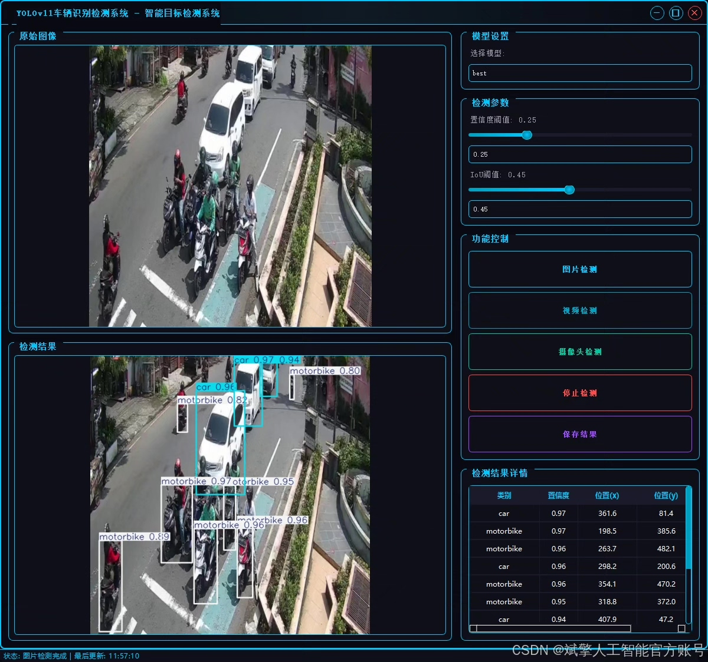
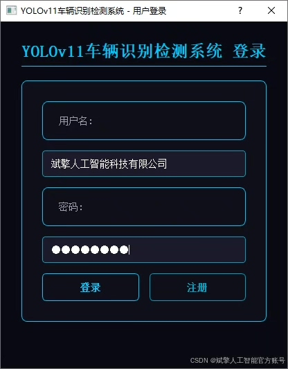
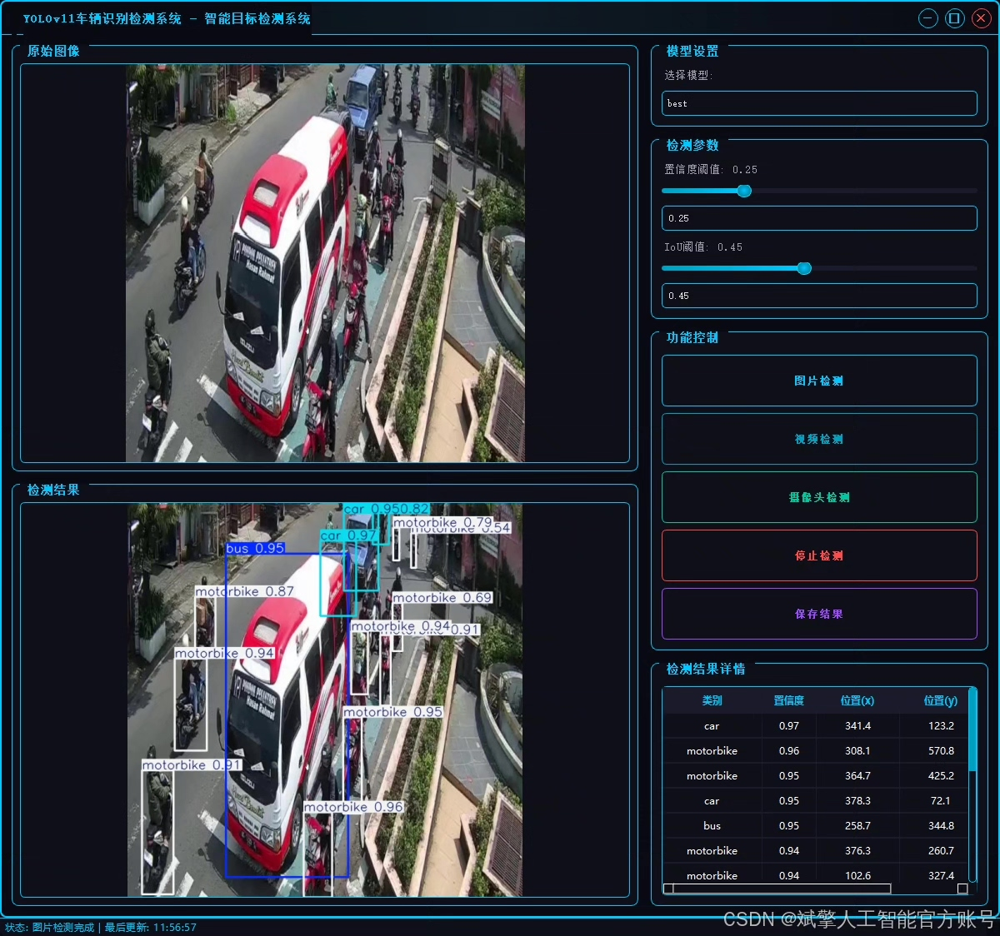
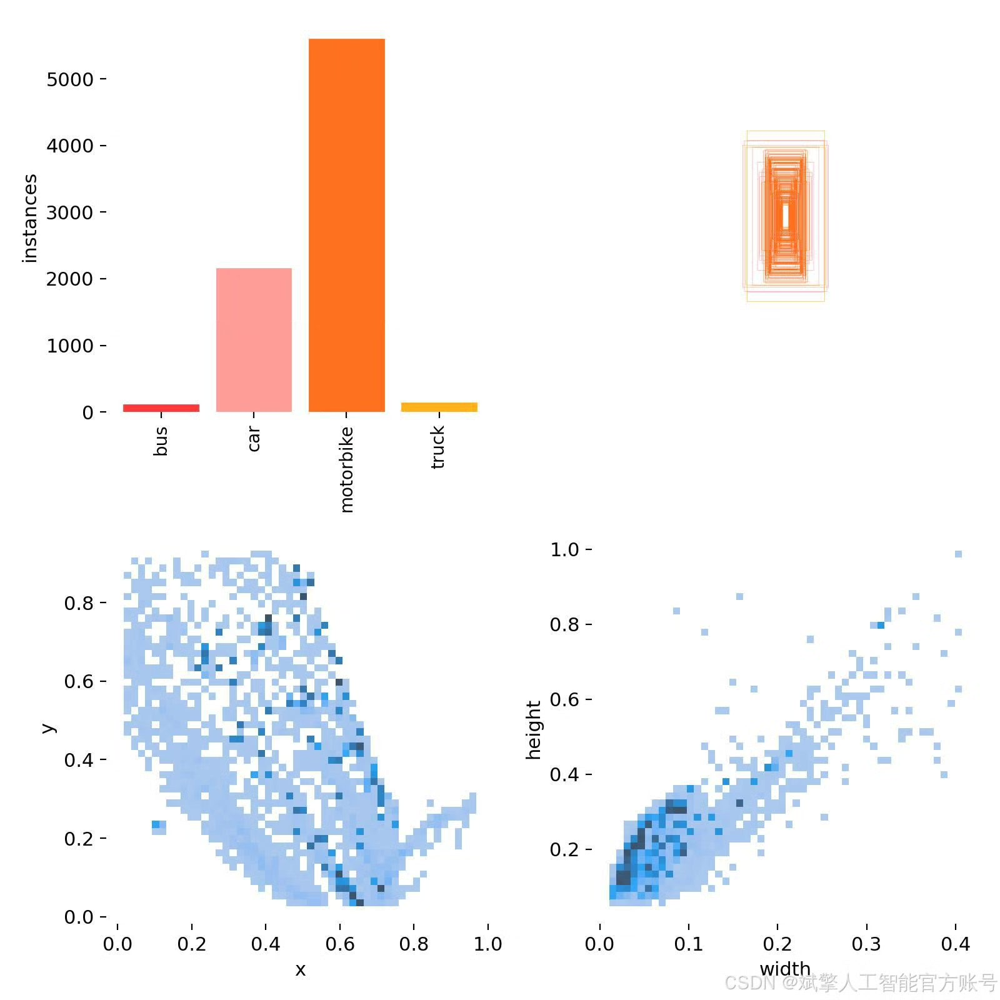
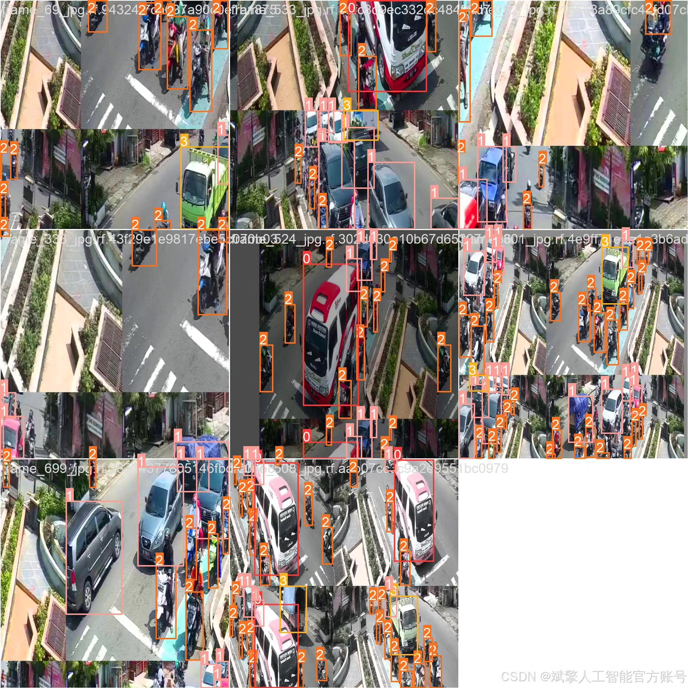
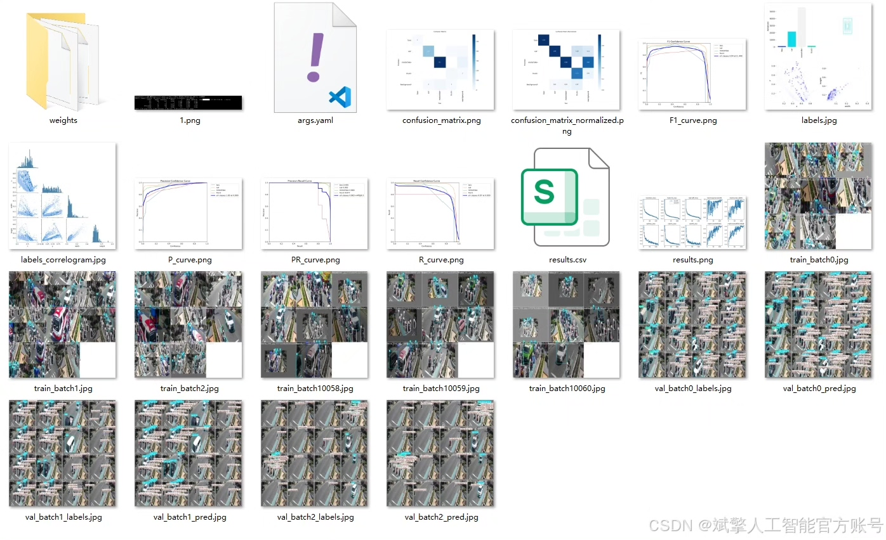
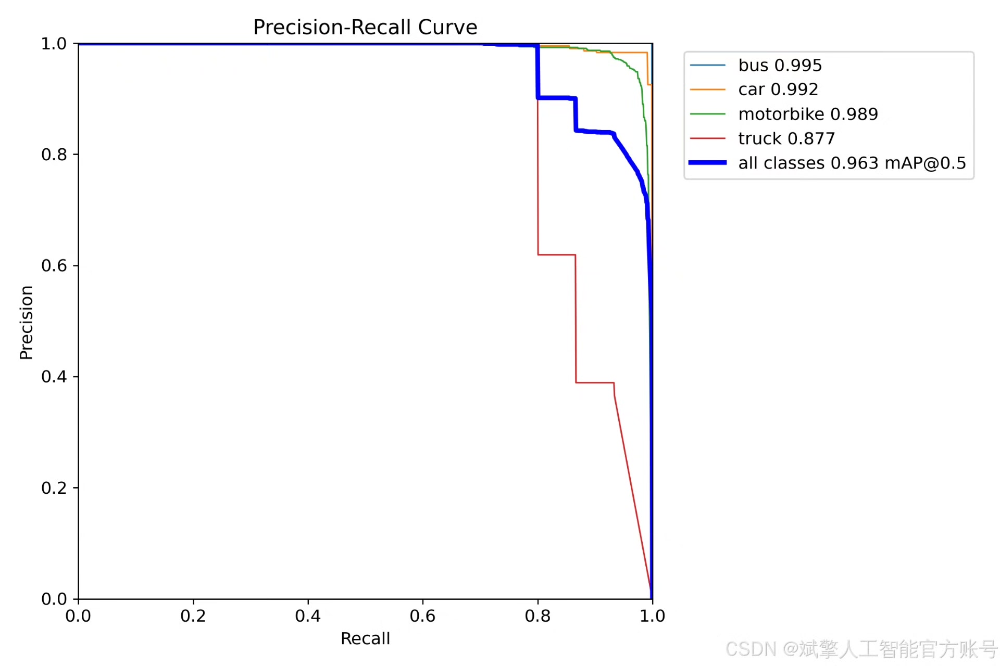
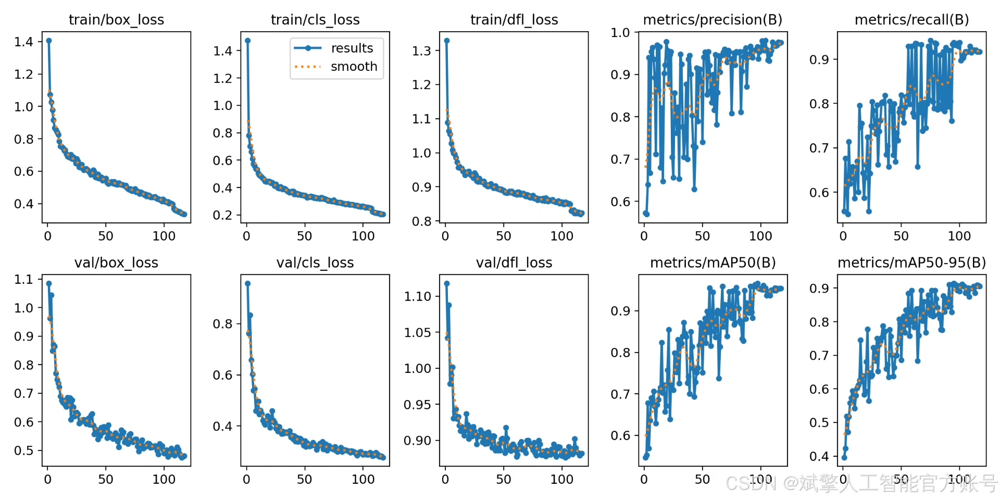
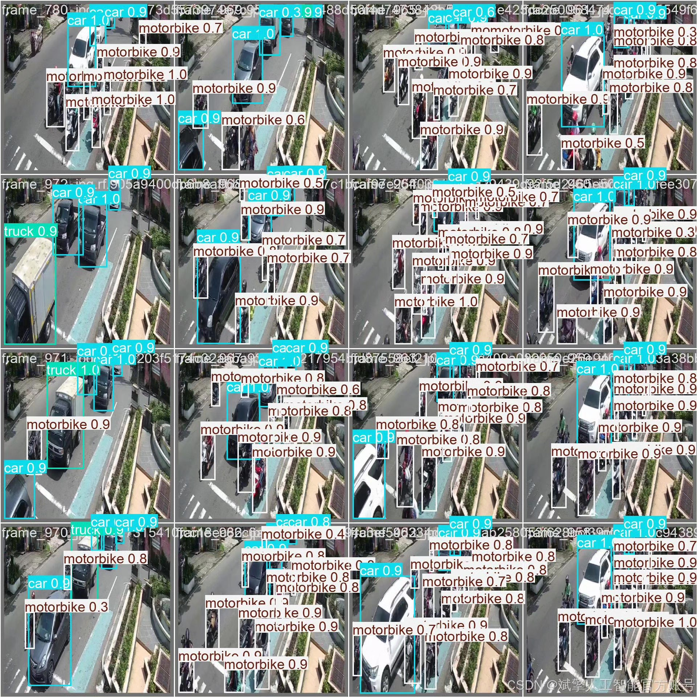

# YOLOv11 vehicle type recognition system

## Body

YOLOv11 Vehicle Type Recognition System Based on Deep Learning YOLOv11: A Vehicle Type Recognition and Classification System (YOLOv11+YOLO dataset + UI interface + login registration interface + Python project source code + model)

This paper proposes a vehicle type recognition and detection system based on deep learning YOLOv11, capable of efficiently and accurately detecting and classifying four common vehicle types (buses, cars, motorcycles, trucks). The system employs the YOLOv11 object detection algorithm, combined with the YOLO format labeled dataset for training and validation, achieving high detection accuracy and real-time performance. Additionally, the system is equipped with a user-friendly UI interface that supports login and registration functions. Experimental results show that the system achieves good recognition effects on the test set, providing reliable technical support for intelligent traffic management and vehicle monitoring applications.

Dataset:
nc: 4
names: ['bus', 'car', 'motorbike', 'truck'],
dataset quantity: 750 training images, 100 validation images, 150 test images.

✅ User Login and Registration: Supports password verification and security validation.
✅ Three detection modes: Based on the YOLOv11 model, supporting image, video, and real-time camera detection, precise target recognition.
✅ Dual-screen comparison: Display original images and detection results in the same screen.
✅ Data visualization: Real-time table displaying the category, confidence, and coordinates of detected targets.
✅ Intelligent parameter adjustment: Offers a confidence slide bar to dynamically optimize detection accuracy, adapting to different scene requirements.
✅ Sci-fi style interactive interface: Dark theme paired with dynamic light effects, reducing visual fatigue and enhancing operational experience.

## Images

## Payment

Here is a pay link on Stripe ( https://buy.stripe.com/3cs8yP7sY87d0vu9AB ). Please contact me lonlonago@foxmail.com after funding $89, and I will send you a complete data files , thank you!

